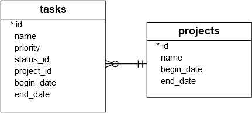
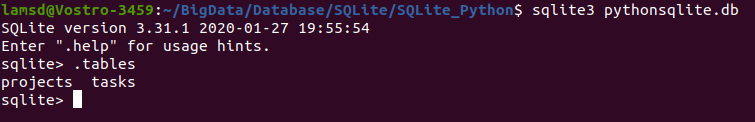

Summary: in this tutorial, we will show you how to create tables in the SQLite database from the Python program using the sqlite3 module.

To create a new table in an SQLite database from a Python program, you use the following steps:

1. First, create a Connection object using the connect() function of the sqlite3 module.
2. Second, create a Cursor object by calling the cursor() method of the Connection object.
3. Third, pass the CREATE TABLE statement to the execute() method of the Cursor object and execute this method.

For the demonstration, we will create two tables: projects and tasks as shown in the following database diagram:



The following CREATE TABLE statements create these two tables:
```
-- projects table
CREATE TABLE IF NOT EXISTS projects (
	id integer PRIMARY KEY,
	name text NOT NULL,
	begin_date text,
	end_date text
);

-- tasks table
CREATE TABLE IF NOT EXISTS tasks (
	id integer PRIMARY KEY,
	name text NOT NULL,
	priority integer,
	project_id integer NOT NULL,
	status_id integer NOT NULL,
	begin_date text NOT NULL,
	end_date text NOT NULL,
	FOREIGN KEY (project_id) REFERENCES projects (id)
);
```
Code language: SQL (Structured Query Language) (sql)

Let’s see how to create new tables in Python.

**First**, develop a function called create_connection() that returns a Connection object which represents an SQLite database specified by the database file parameter db_file.
```
def create_connection(db_file):
    """ create a database connection to the SQLite database
        specified by db_file
    :param db_file: database file
    :return: Connection object or None
    """
    conn = None
    try:
        conn = sqlite3.connect(db_file)
        return conn
    except Error as e:
        print(e)

    return conn
```
Code language: Python (python)

**Second**, develop a function named create_table() that accepts a Connection object and an SQL statement. Inside the function, we call the execute() method of the Cursor object to execute the CREATE TABLE statement.
```
def create_table(conn, create_table_sql):
    """ create a table from the create_table_sql statement
    :param conn: Connection object
    :param create_table_sql: a CREATE TABLE statement
    :return:
    """
    try:
        c = conn.cursor()
        c.execute(create_table_sql)
    except Error as e:
        print(e)
```        
Code language: SQL (Structured Query Language) (sql)

**Third**, create a main() function to create the  projects and tasks tables.
``` 
def main():
    database = r"C:\sqlite\db\pythonsqlite.db"

    sql_create_projects_table = """ CREATE TABLE IF NOT EXISTS projects (
                                        id integer PRIMARY KEY,
                                        name text NOT NULL,
                                        begin_date text,
                                        end_date text
                                    ); """

    sql_create_tasks_table = """CREATE TABLE IF NOT EXISTS tasks (
                                    id integer PRIMARY KEY,
                                    name text NOT NULL,
                                    priority integer,
                                    status_id integer NOT NULL,
                                    project_id integer NOT NULL,
                                    begin_date text NOT NULL,
                                    end_date text NOT NULL,
                                    FOREIGN KEY (project_id) REFERENCES projects (id)
                                );"""

    # create a database connection
    conn = create_connection(database)

    # create tables
    if conn is not None:
        # create projects table
        create_table(conn, sql_create_projects_table)

        # create tasks table
        create_table(conn, sql_create_tasks_table)
    else:
        print("Error! cannot create the database connection.")
        
```
Code language: Python (python)

**Fourth**, execute the main() function.
```
if __name__ == '__main__':
    main()
    
```

Use the .tables command to display the tables in the database.
```
sqlite> .tables
projects  tasks
```

# Tài liệu tham khảo:
1. https://www.sqlitetutorial.net/sqlite-python/create-tables/