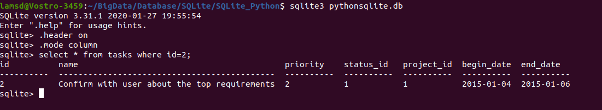

# SQLite Python: Updating Data

Summary: in this tutorial, we will show you how to update data in the SQLite database from a Python program using the sqlite3 module.

To update data in a table from a Python program, you follow these steps:

- First, create a database connection to the SQLite database using the connect() function. Once the database connection created, you can access the database using the Connection object.
- Second, create a Cursor object by calling the cursor() method of the Connection object.
- Third, execute the UPDATE statement by calling the execute() method of the Cursor object.

In this example we will update the priority, begin date, and end date of a specific task in the tasks table.

To create a database connection, you use the following create_connection() function:
```
def create_connection(db_file):
    """ create a database connection to the SQLite database
        specified by the db_file
    :param db_file: database file
    :return: Connection object or None
    """
    conn = None
    try:
        conn = sqlite3.connect(db_file)
    except Error as e:
        print(e)

    return conn
```
Code language: SQL (Structured Query Language) (sql)

This update_task() function update a specific task:
```
def update_task(conn, task):
    """
    update priority, begin_date, and end date of a task
    :param conn:
    :param task:
    :return: project id
    """
    sql = ''' UPDATE tasks
              SET priority = ? ,
                  begin_date = ? ,
                  end_date = ?
              WHERE id = ?'''
    cur = conn.cursor()
    cur.execute(sql, task)
    conn.commit()
```
Code language: Python (python)

The following main() function creates a connection to the database located in C:\sqlite\db\pythonsqlite.db folder  and call the update_task() function to update a task with id 2:
```
def main():
    database = r"C:\sqlite\db\pythonsqlite.db"

    # create a database connection
    conn = create_connection(database)
    with conn:
        update_task(conn, (2, '2015-01-04', '2015-01-06', 2))


if __name__ == '__main__':
    main()
    
```

Use these command to format the output:
```
sqlite> .header on
sqlite> .mode column

```
Code language: CSS (css)

And use the following statement to get the task with id 2:
```
SELECT * FROM tasks WHERE id = 2;
```

## Tài liệu tham khảo:
1. https://www.sqlitetutorial.net/sqlite-python/update/